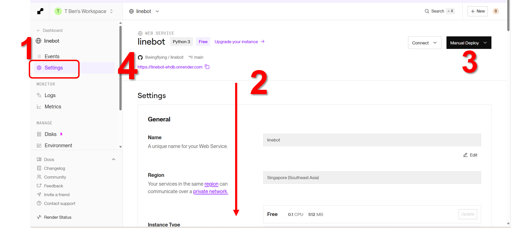
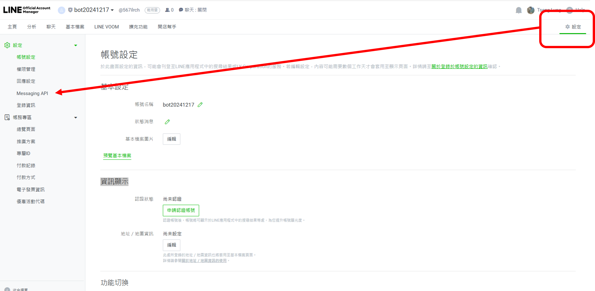
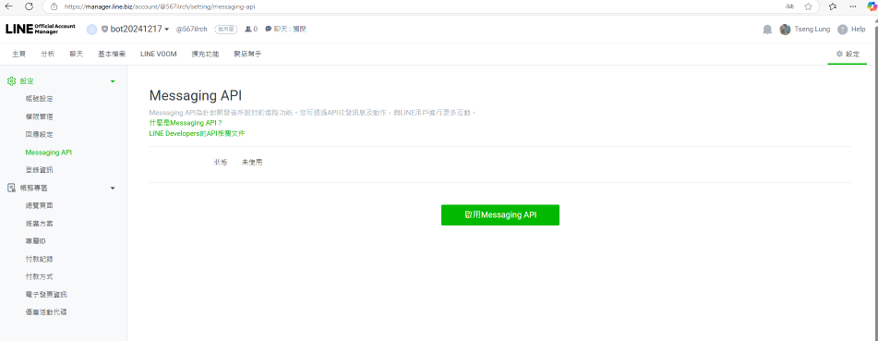

# 小專案開發: 發票兌獎機器人
# 延伸閱讀
- [只要有心，人人都可以做卡米狗 系列]()
- [從零開始構建能理解語義的 Linebot 架構 系列](https://ithelp.ithome.com.tw/users/20105227/ironman/7622)
- [LINE BOT 教學]()

# 步驟與流程
- 步驟1:開發程式並佈署到你的特定github
- 步驟2:設定render平台 ==> 取得網站的網址
- 步驟3:Line 設定
  - 填入 render網站的網址
  - 將 line連線所需要的 credential 填入程式

# 步驟1:開發程式並佈署到你的特定github
- 放在你Github上的程式
- [使用python開發的機器人程式 8wingflying/linebot](https://github.com/8wingflying/linebot)
```python
# -*- coding: utf-8 -*-

import os
import requests
import xml.etree.ElementTree as ET
from flask import Flask, request, abort
from linebot import LineBotApi, WebhookHandler
from linebot.exceptions import InvalidSignatureError
from linebot.models import MessageEvent, TextMessage, TextSendMessage

app = Flask(__name__)

line_bot_api = LineBotApi('')
handler = WebhookHandler('')

# 定義中獎訊息
prize_messages = {
    "特別獎": "恭喜！您中了特別獎，獎金新臺幣一千萬元。",
    "特獎": "恭喜！您中了特獎，獎金新臺幣二百萬元。",
    "頭獎": "恭喜！您中了頭獎，獎金新臺幣二十萬元。",
    "二獎": "恭喜！您中了二獎，獎金新臺幣四萬元。",
    "三獎": "恭喜！您中了三獎，獎金新臺幣一萬元。",
    "四獎": "恭喜！您中了四獎，獎金新臺幣四千元。",
    "五獎": "恭喜！您中了五獎，獎金新臺幣一千元。",
    "六獎": "恭喜！您中了六獎，獎金新臺幣二百元。"
}

# 解析中獎號碼的函數
def check_invoice(invoice_number):
    # 從網址取得 XML 資料
    url = 'https://invoice.etax.nat.gov.tw/invoice.xml'
    try:
        response = requests.get(url, timeout=10)
        if response.status_code == 200:
            tree = ET.fromstring(response.text)
            item = tree.find('.//item')
            description = item.find('description').text
            special_prize = description.split('<p>特別獎：')[1].split('</p>')[0]
            grand_prize = description.split('<p>特獎：')[1].split('</p>')[0]
            first_prizes_str = [x.split('</p>')[0] for x in description.split('<p>頭獎：')[1:]]  # 取得所有頭獎的字串列表

            # 將每個頭獎字串進一步分割為單獨的頭獎號碼
            first_prizes = []
            for prize_str in first_prizes_str:
                first_prizes.extend(prize_str.split('、'))  # 將多個頭獎號碼加入到列表中
            # 檢查是否中獎
            if invoice_number == special_prize:
                answer= "特別獎"
            elif invoice_number == grand_prize:
                answer= "特獎"
            else:
                for i in first_prizes:
                    if invoice_number == i:
                        answer= "頭獎"
                    elif invoice_number[-7:]==i[-7:]:
                        answer= "二獎"
                    elif invoice_number[-6:]==i[-6:]:
                        answer= "三獎"
                    elif invoice_number[-5:]==i[-5:]:
                        answer= "四獎"
                    elif invoice_number[-4:]==i[-4:]:
                        answer= "五獎"
                    elif invoice_number[-3:]==i[-3:]:
                        answer= "六獎"
            try:
                return answer
            except:
                return "可惜，您沒有沒中獎"
        else:
            return "Error fetching the XML data."
    except requests.exceptions.Timeout:
        return "Connection timed out."
    except requests.exceptions.ConnectionError:
        return "Connection error occurred."

# Line Bot 的 Webhook 處理
@app.route("/callback", methods=['POST'])
def callback():
    signature = request.headers['X-Line-Signature']
    body = request.get_data(as_text=True)
    try:
        handler.handle(body, signature)
    except InvalidSignatureError:
        abort(400)
    return 'OK'

# 處理使用者發送的訊息
@handler.add(MessageEvent, message=TextMessage)
def handle_message(event):
    user_input = event.message.text.strip()

    # 檢查是否為 8 位數的數字
    if user_input.isdigit() and len(user_input) == 8:
        result = check_invoice(user_input)
        # 回覆訊息
        if result in prize_messages:
            reply_message = prize_messages[result]
        else:
            reply_message = result
        line_bot_api.reply_message(event.reply_token, TextSendMessage(text=f"您輸入的發票號碼為：{user_input}\n {reply_message}"))
    else:
        line_bot_api.reply_message(event.reply_token, TextSendMessage(text="請輸入 8 位數的發票號碼。"))

if __name__ == '__main__':
    app.run(host='0.0.0.0', port=int(os.environ.get('PORT', 5000)))
```


# 步驟2:render設定
- https://render.com/
- 主要的認定任務
  - 1.安裝應用程式執行所需要的套件與工具
  - 2.啟動應用程式平台
  - 3.紀錄


- Settings ==> 上圖紅色2號的各種設定
  - General(一般設定)
    - Name(A unique name for your Web Service.) ==> linebot
    - Region|所在區域(Your services in the same region can communicate over a private network.) ==> Singapore (Southeast Asia)
    - Instance Type: Free
  - Build & Deploy(建置與佈署)
    - Repository|程式所在的地方(The repository used for your Web Service.) ==> https://github.com/8wingflying/linebot
  - Branch(The Git branch to build and deploy.) ==> main
  - Git Credentials(User providing the credentials to pull the repository.) ==> 8wingflying@gmail.com (you)
  - Root DirectoryOptional
  - Build Filters
    - Included Paths
    - Ignored Paths
  - Build Command ==> pip install line-bot-sdk flask gunicorn pysqlite3
  - Pre-Deploy CommandOptional
  - Start Command ==> gunicorn linebottest:app
  - Auto-Deploy ==> Yes
    - By default, Render automatically deploys your service whenever you update its code or configuration. Disable to handle deploys manually. Learn more.
  - Deploy hook ==> ••••••••••••••••••••••••••••••••••••••••••••••••••••••••••••••••••••••
    - Your private URL to trigger a deploy for this server. Remember to keep this a secret.
  - Custom Domains
    - Your service is always available at https://linebot-ehdb.onrender.com
    - You can also point custom domains you own to this service. See DNS configuration instructions.

# 步驟3:Line設定
- 官方帳號的建立流程
  - 1.LINE Official Account Manager
    - 1.建立帳號
    - 2.啟用Messaging API
    - 3.設定Webhook
  - 2.LINE Developer Console
    - 取得Access Token
- [line developer開發者平台](https://developers.line.biz/en/)
  - 步驟3-1:點選 Console home ==> 點選 PROVIDER ==> 按CREATER 建立BOT ==> BOT20241217
  - 步驟3-2:設定BOT20241217
    - 點選BOT20241217
    - 點選Create a Messaging API channel
    - Create a Messaging API channel ==> 跳到LINE官方帳號(Line Official Account Manager)進行後續設定
- LINE官方帳號(Line Official Account Manager)
  - 建立LINE官方帳號(Line Account Manager)==> 建立後點選最右上角落的'設定'
  - 底選左邊 Message API



  - 點選`啟用 Message API`

  - 設定
  - 帳號設定
  - 權限管理
  - 回應設定
- Messaging API
登錄資訊
- Basic settings
  - Basic information
  - You can change your app name and icon in LINE Official Account Manager.
  - Channel ID
  - Channel icon
  - Channel name
  - Channel description
  - Email address: XXX@gmail.com
  - Privacy policy URL
  - Terms of use URL optional
  - App types
  - Bot
  - Permissions
  - PROFILE
  - Channel secret
  - Assertion Signing Key
  - Your user ID
  - Delete this channel 
- Messaging API
  - Webhook settings
    - Webhook URL==> https://linebot-ehdb.onrender.com/callback
  - Channel access token
    - Channel access token (long-lived)
- LIFF | LINE Front-end Framework
- Security
- Statistics
- Roles


- 在創建頻道頁面（Create a new channel）依照底下提示輸入：
- Channel type（頻道）：Messaging API
- Provider（類型）：My Provider
- Company or owner’s country or region（所在國家）：填入目前居住國家台灣直接選 Taiwan
- Channel icon（頻道圖示）：點我下載 ChatGPT 圖示
- Channel name（頻道名字）：ChatGPT AI Assistant （先輸入後續可修改）
